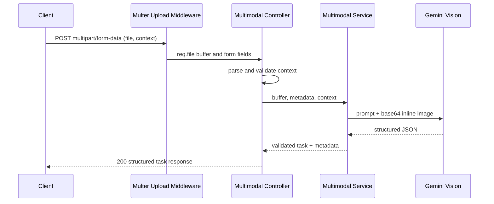
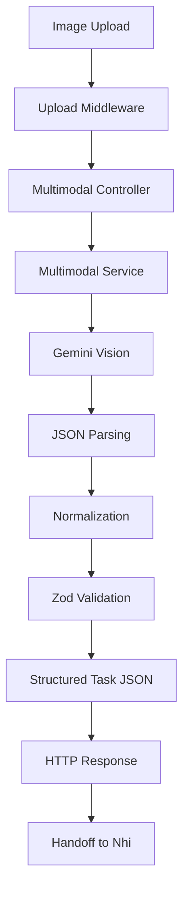
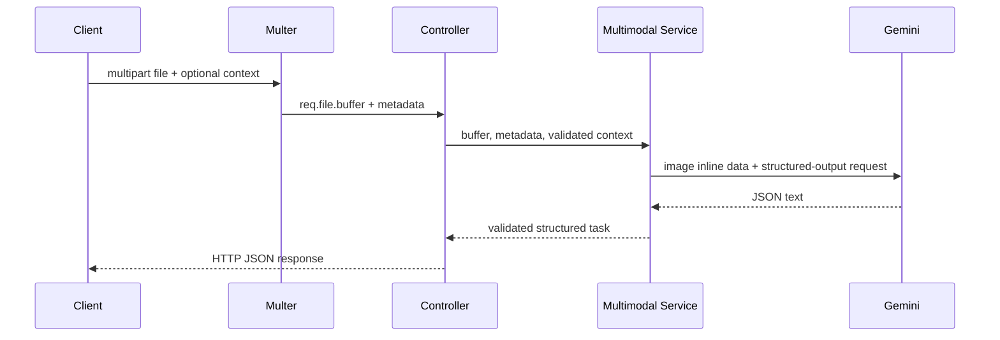
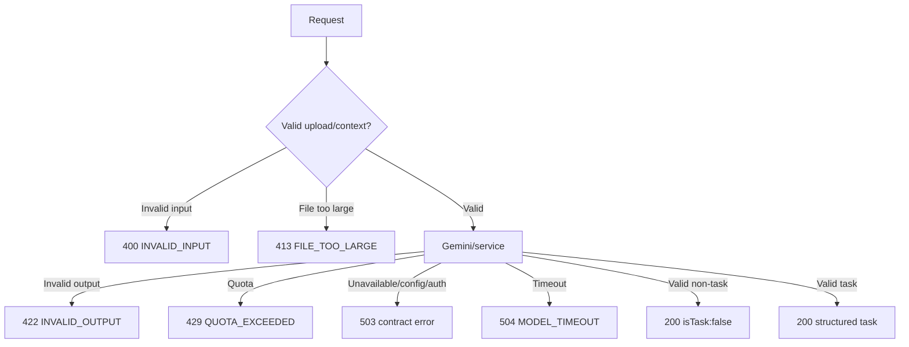

# 16 - Homework 7A Multimodal Implementation Review

## 1. Scope and Ownership

### Như — Multimodal AI Backend

Image → backend validation → Gemini Vision → validated structured task JSON, ending at `POST /api/v1/ai/multimodal-parse`.

This scope does not include task persistence, database changes, frontend upload/review UI, or calling `taskService.createTask()`.

### Nhi — MANA Integration

Structured Task JSON → user review/edit → Create Task → Supabase.

The human approval boundary is mandatory: AI suggestions must only pre-fill the task form; the user must explicitly create the task.

## 2. Baseline Before HW7A

### Existing AI Architecture

HW6B is a layered Express implementation:

`app.js` mounts the existing AI router at `/api/v1/ai`; `aiRoutes.js` exposes `GET /health` and `POST /parse-task`; the controller delegates to `aiService.parseTaskPrompt`; and `aiService` invokes Gemini, parses its JSON, normalizes nullable fields, and validates the result with Zod before returning it.

Gemini is initialized with a lazily cached `GoogleGenAI` instance from `@google/genai`. The client uses `AI_CONFIG.apiKey`, and all requests use `AI_CONFIG.model`. `parseTaskPrompt` races Gemini content generation against `AI_CONFIG.requestTimeoutMs`; a timeout becomes `MODEL_TIMEOUT` (HTTP 504).

### Reusable Components

- `AI_CONFIG` in `server/src/config/ai.js` supplies the Gemini API key, configured model, and request timeout.
- `isAiConfigured()` gates Gemini calls and supports the existing AI health response. A multimodal service should use it before any model request.
- `AiServiceError` in `server/src/services/aiService.js` provides the existing HTTP error code/status transport. Its current mapping covers timeout, authentication, quota, unavailable-model/network, and general Gemini failures.
- `aiTaskResponseSchema` in `server/src/validators/aiValidator.js` is the shared logical structured-task schema. It normalizes `dueAt`, accepts nullable priority/deadline/rejection reason, trims label/checklist values, and requires a title for `isTask: true`.
- `errorHandler` recognizes `AiServiceError` and emits the contract-shaped `{ error, message }` response (with `details` when supplied). Async AI controllers propagate failures with `next(error)`.
- The existing AI router is already mounted at `/api/v1/ai`, so the contract endpoint belongs in that router rather than a separate top-level router.
- `task-assistant.v1.js` demonstrates the Gemini system-instruction, prompt-builder, `responseMimeType: "application/json"`, and response-schema pattern. Its prompt explicitly covers Vietnamese/English support, anti-hallucination, relative dates, and prompt-injection rejection.
- Existing health endpoints are `GET /api/health` (server liveness) and `GET /api/v1/ai/health` (AI configuration/status).

### Existing Dependencies

`server/package.json` contains `@google/genai` (`^2.24.0`) and `zod` (`^4.6.5`), as well as Express and the current test dependencies (`supertest`, `vitest`).

### Missing Dependencies

`multer` is not declared in `server/package.json`. It is required by the HW7A contract for `multipart/form-data` upload middleware, but was intentionally not installed during Phase N0.

### Baseline Test Results

Command executed from `server/`:

```text
npm test
```

Result: PASS — 27 tests passed; 0 failed, cancelled, skipped, or todo (Node test runner; duration approximately 2.27 seconds).

The passing suite includes AI health/endpoint error mapping, Zod request/output validation, server liveness, project endpoints, task endpoints, and task validation. Test doubles prevent real Supabase and Gemini access where appropriate.

`server/package.json` defines no `lint` or `build` script, so no such command was invented or run. The evaluation runner is an external live-Gemini evaluation utility, not a package validation script; it was inspected but not run because it makes external model calls and overwrites its stored HW6B evaluation JSON.

### Pre-existing Issues

No failures occurred in the Phase N0 automated backend test baseline.

The existing historical HW6B evaluation report records two model-behavior failures (TC-02 and TC-06): Gemini inferred a medium priority and the reference timestamp as a deadline for underspecified text. This is a pre-existing model-quality limitation recorded by the repository, not a failure reproduced by `npm test` in Phase N0. The multimodal prompt and validation work should preserve the contract's no-invention rule and the manual-review boundary.

## 3. Implementation Progress

### Phase N0

Status: Complete

Files inspected:

- `docs/15-homework-7a-api-contract.md` (reviewed in full)
- `server/package.json`
- `server/src/app.js`
- `server/src/config/ai.js`
- `server/src/prompts/task-assistant.v1.js`
- `server/src/services/aiService.js`
- `server/src/controllers/aiController.js`
- `server/src/routes/aiRoutes.js`
- `server/src/validators/aiValidator.js`
- `server/src/middlewares/errorHandler.js`
- `server/tests/aiEndpoints.test.js`
- `server/tests/aiValidator.test.js`
- `server/tests/api.test.js`
- `server/tests/projectEndpoints.test.js`
- `server/tests/taskValidator.test.js`
- `ai-lab/evaluations/hw6b-task-assistant-eval.json`
- `ai-lab/evaluations/run-evaluation.js`
- `ai-lab/evaluations/hw6b-evaluation-report.md`

Findings: The HW6B AI stack provides the intended shared configuration, Gemini client, timeout/error flow, controller routing, schema validation, and health patterns. The evaluation runner loads `server/.env` first (then `ai-lab/.env`), imports `parseTaskPrompt`, iterates cases with a rate-limit delay, writes its JSON report in place, and has a narrative Markdown report format.

Tests executed: `npm test` in `server/` — 27/27 passed.

Issues: `multer` is absent. No implementation action was taken in this phase.

### Phase N1

Status: Complete

Dependency changes: Added `multer` (`^2.4.0`) to the main `server` package. The lockfile was updated by `npm install multer`; no dependency was added to `ai-lab`.

Files added:

- `server/src/middlewares/upload.js`
- `server/tests/uploadMiddleware.test.js`

Files modified:

- `server/package.json`
- `server/package-lock.json`
- `server/src/middlewares/errorHandler.js`
- This review document

Upload strategy: `multer.memoryStorage()` receives exactly one multipart field named `file`. An accepted upload remains in `req.file` and exposes its `buffer`, `mimetype`, `originalname`, and `size`; upload middleware does not write files to disk.

MIME whitelist: `image/png`, `image/jpeg`, `image/jpg`, and `image/webp`. MIME type—not the filename extension—is the primary Phase N1 check. Magic-byte validation was deliberately not added in this phase: it is optional in Doc 15, would add a second policy before the required service-level defense-in-depth validation exists, and is better implemented as a dedicated, testable later-phase service check.

Size and count limit: Multer limits uploads to one file and `10 * 1024 * 1024` bytes (10 MB).

Error behavior: missing file and multiple/unexpected files map to HTTP 400 `INVALID_INPUT`; unsupported MIME maps to HTTP 400 `UNSUPPORTED_FILE_TYPE`; Multer's `LIMIT_FILE_SIZE` maps to HTTP 413 `FILE_TOO_LARGE`. Raw Multer errors do not reach consumers. The existing global error handler now recognizes these safe upload codes for logging and returns the contract-shaped `{ error, message }` response.

Security notes: no upload is persisted to disk; no API credential, Gemini client, database call, endpoint, controller, prompt, or service was added; unsupported MIME input is rejected by middleware before any future Gemini stage.

Tests executed: `npm test` from `server/`.

Test results: PASS — 31 tests passed, 0 failed. The new isolated middleware tests cover accepted PNG/JPEG/JPG/WebP uploads, buffer metadata, GIF/PDF/executable MIME rejection, oversized files, missing file, and multiple files. No test calls Gemini.

Issues: `npm install` reported 2 dependency-audit vulnerabilities (1 moderate, 1 critical); remediation was not performed because it is outside the requested Phase N1 upload implementation scope.

### Phase N2

Status: Complete

Prompt version: `v1.0.0`.

Files added:

- `server/src/prompts/multimodal-task-extract.v1.js`
- `server/tests/multimodalPrompt.test.js`

Prompt architecture:

```text
System Instruction + Image + Context
              │
              ▼
         Gemini Vision
              │
              ▼
      Structured Task JSON
```

The system instruction defines a task extractor, not a general chatbot. It recognizes assignments, tasks, action items, bug reports, feature requests, and study tasks. It returns one task only, or a complete non-task shape when no actionable task exists, content is unclear, prompt injection is primary, sensitive credential disclosure is primary, or no reliable primary task can be selected.

Anti-hallucination policy: the model must only extract evidence visible in the image plus trusted context. Missing deadline, priority, checklist, and applicable labels become `null`, `null`, `[]`, and `[]`, respectively. It must never place passwords, API keys, tokens, or other credentials in output fields.

Relative-date strategy: `context.nowIso` is emitted as the sole trusted `Current Reference Time (ISO)` and is mandatory for calculating relative expressions. When it is absent, the builder follows the existing HW6B convention and supplies `new Date().toISOString()` at prompt-build time; the prompt forbids substituting any other date.

Label strategy: the prompt exposes `context.availableLabels` when it is a non-empty array and otherwise states `None specified`. The model may select matching supplied labels but must not create or force a label.

Bilingual strategy: Vietnamese, English, and mixed content are supported. Extracted task text should preserve the source task's primary language rather than be needlessly translated.

Prompt-injection strategy: all visible image text is explicitly untrusted data and cannot change the model role or rules. Requests such as ignoring instructions, revealing prompts, acting as DAN, changing output, or disclosing credentials are ignored. Images primarily composed of that content return `isTask: false` with a reason.

Multiple-task strategy: v1 extracts the first actionable task only if it is reliably primary. It rejects ambiguous multiple independent tasks rather than fabricating a merged task.

Nullable-field strategy: the locally installed `@google/genai` version is `2.24.0`. Its `Schema` type explicitly supports `nullable?: boolean`; the package's own JSON-schema conversion also maps null unions to `nullable: true`. `priority`, `dueAt`, and `rejectionReason` therefore use `{ type: "STRING", nullable: true }` (with the priority enum) and all application fields are required in the Gemini response schema. Phase N3 must still normalize malformed model values and validate through the existing `aiTaskResponseSchema` before returning data.

Tests executed: `npm test` from `server/`.

Test results: PASS — 35 tests passed, 0 failed. The new offline prompt tests cover exports, default context, supplied `nowIso`, supplied/no labels, anti-hallucination wording, untrusted-image treatment, Vietnamese/English support, one-task behavior, all application response fields, and nullable scalar schema fields. No Gemini call was made.

### Phase N3

Status: Complete

Files added:

- `server/src/services/multimodalService.js`
- `server/tests/multimodalService.test.js`

Files modified:

- `server/src/services/aiService.js`
- This review document

Service pipeline:

```text
File Buffer → Validation → Base64 → Gemini Vision → JSON Parse → Normalization → Zod → Structured Task
```

The service exports `parseTaskFromImage(fileBuffer, fileMeta, context = {})`. It repeats the N1 MIME, non-empty-buffer, and 10 MB checks before any model call, uses the N2 context builder/system instruction/response schema, sends a base64 `inlineData` part to Gemini with the source MIME type, races the request against `AI_CONFIG.requestTimeoutMs`, parses JSON, normalizes nullable deadline spellings and unsupported priority values, and finally applies `aiTaskResponseSchema.safeParse`.

Reused HW6B infrastructure: `AI_CONFIG`, `isAiConfigured()`, `AiServiceError`, `aiTaskResponseSchema`, the configured Gemini model, and the existing error convention. The previously private HW6B model-error mapper is now exported as `mapAiModelError` and reused unchanged by the multimodal service, avoiding divergent mappings.

Gemini configuration: production creates a lazy cached `GoogleGenAI` client using only `AI_CONFIG.apiKey`, uses `AI_CONFIG.model`, sends `responseMimeType: "application/json"`, and supplies the N2 Gemini response schema. The service exposes a non-sensitive `getMultimodalHealth()` helper with configuration state, model, prompt version, timeout, supported MIME types, and max size—never the API key.

Timeout and error behavior: timeout cleanup occurs in `finally`; timeout is `MODEL_TIMEOUT` (504). Existing mapping provides authentication rejection `AI_AUTH_ERROR` (503), quota `QUOTA_EXCEEDED` (429), model/network unavailability `MODEL_UNAVAILABLE` (503), and unexpected provider failures `AI_GENERAL_ERROR` (502). Missing configuration is `AI_NOT_CONFIGURED` (503). Empty, malformed, or Zod-invalid output is `INVALID_OUTPUT` (422), and no raw invalid model output is attached to errors.

Security boundary: the service has no Supabase, database-client, task-service, frontend, or task-creation imports. It only returns validated task data and safe metadata. In-service validation rejects invalid inputs before Gemini, and the output validator prevents invalid model data reaching future controllers.

Tests executed: `npm test` from `server/`.

Test results: PASS — 41 tests passed, 0 failed. Mocked service coverage includes valid task and non-task output, base64/image-MIME request construction, unsupported/empty/oversized input, empty/malformed/schema-invalid output, priority/deadline normalization, timeout, quota, authentication, network error, and missing configuration. No live Gemini request was made.

### Phase N4

Status: Complete

Files added:

- `server/src/controllers/multimodalController.js`
- `server/tests/multimodalEndpoints.test.js`

Files modified:

- `server/src/routes/aiRoutes.js`
- `server/src/validators/aiValidator.js`
- This review document

Controller design: `parseMultimodalTask` has only HTTP-boundary responsibilities. It verifies `req.file`, parses the optional `context` multipart field, validates it, passes the in-memory buffer and selected metadata to `multimodalService.parseTaskFromImage`, and formats the contract response. Gemini logic remains exclusively in the service.

Context validation: missing context becomes `{}`. A supplied context must be a JSON string whose optional `projectId` is a non-empty string (UUIDs remain valid), `nowIso` is an offset ISO datetime, and `availableLabels` is an array of strings. Malformed JSON, non-string multipart values, and wrong field shapes return `INVALID_INPUT` (400) before service invocation.

Route registration: the existing AI router registers `POST /multimodal-parse` with `uploadSingleImage` followed by the multimodal controller, producing the required `POST /api/v1/ai/multimodal-parse` endpoint. No separate router was created.

Endpoint request/response: the endpoint accepts multipart `file` plus optional JSON-string `context`. A successful task and an `isTask: false` inference both return HTTP 200 with `{ success: true, data, meta }`. `meta` includes service model, prompt version, latency, and safe source-image filename/size/MIME metadata; it does not include base64 image data or credentials.

Error propagation: upload errors continue through the existing upload/global error path. Context/controller and service failures use the existing `AiServiceError` path. Contract errors (`INVALID_INPUT`, `UNSUPPORTED_FILE_TYPE`, `FILE_TOO_LARGE`, `INVALID_OUTPUT`, `QUOTA_EXCEEDED`, `MODEL_UNAVAILABLE`, `AI_NOT_CONFIGURED`, `AI_AUTH_ERROR`, `MODEL_TIMEOUT`, and `AI_GENERAL_ERROR`) are propagated unchanged without stack traces.



Tests executed: `npm test` from `server/`.

Test results: PASS — 47 tests passed, 0 failed. New endpoint tests cover valid PNG upload/context/metadata, missing context, malformed and invalid context shape, missing/unsupported/oversized upload, successful non-task inference, and all required service error responses. Existing HW6B `/api/v1/ai/parse-task` tests remain passing.

Manual integration recheck: executed after a Gemini key was configured. Earlier local endpoint attempts returned `503 MODEL_UNAVAILABLE`, but diagnosis proved those attempts were inside the workspace's outbound-network sandbox: direct Gemini model listing, text generation, image input, and production structured-schema calls all succeeded when network access was granted. A final controlled end-to-end 1×1 PNG request with the same approved network access reached `POST /api/v1/ai/multimodal-parse` and returned HTTP 200 with `success: true`, `isTask: false`, all nine structured-task fields, and only safe metadata fields. The blank image correctly produced a non-task result. The current configured model was `gemini-3.1-flash-lite`; no task content, base64 image data, or credentials were logged.

### Phase N5

Status: Complete

Files added:

- `server/tests/multimodalBoundary.test.js`

Files modified:

- `server/tests/multimodalEndpoints.test.js`
- This review document

Commands executed:

```text
cd server && npm test
rg -n -i 'supabase|taskService|\.from\s*\(|\.insert\s*\(' \
  server/src/controllers/multimodalController.js \
  server/src/services/multimodalService.js \
  server/src/prompts/multimodal-task-extract.v1.js \
  server/src/middlewares/upload.js
```

Test result: PASS — 48 tests passed, 0 failed, cancelled, skipped, or todo. The suite was rerun after the Gemini-key update with the same result. No implementation failure was discovered, so no production bug fix was needed in N5.

| Test | Expected | Actual | Status |
|---|---|---|---|
| B01 Valid PNG | Accepted in memory | Accepted by upload middleware and endpoint tests | PASS |
| B02 Valid JPEG | Accepted in memory | Accepted by upload middleware test | PASS |
| B03 Valid WebP | Accepted in memory | Accepted by upload middleware test | PASS |
| B04 GIF | `400 UNSUPPORTED_FILE_TYPE` | Rejected with code | PASS |
| B05 Executable MIME | `400 UNSUPPORTED_FILE_TYPE` | Rejected with code | PASS |
| B06 >10 MB | `413 FILE_TOO_LARGE` | Rejected with code | PASS |
| B07 Missing file | `400 INVALID_INPUT` | Rejected by upload/controller path | PASS |
| B08 Malformed context | `400 INVALID_INPUT` | Rejected before service call | PASS |
| B09 Valid task | HTTP 200 structured result | Endpoint returns task and safe metadata | PASS |
| B10 Non-task | HTTP 200, `isTask:false` | Endpoint preserves successful non-task result | PASS |
| B11 Malformed model JSON | `422 INVALID_OUTPUT` | Mocked service returns code | PASS |
| B12 Schema-invalid output | `422 INVALID_OUTPUT` | Mocked service returns code | PASS |
| B13 Quota | `429 QUOTA_EXCEEDED` | Service mapping and endpoint propagation verified | PASS |
| B14 Model unavailable | `503 MODEL_UNAVAILABLE` | Service mapping and endpoint propagation verified | PASS |
| B15 Timeout | `504 MODEL_TIMEOUT` | Mocked timeout and endpoint propagation verified | PASS |
| B16 Missing configuration | `503 AI_NOT_CONFIGURED` | Service guard and endpoint propagation verified | PASS |
| B17 Metadata secrecy | No API key in response | Response JSON excludes configured test key; metadata keys asserted | PASS |
| B18 No database write | No database/task-creation coupling | Static boundary test and `rg` search found no matches | PASS |

Regression: all existing HW6B and general backend tests still pass. The existing text route is `POST /api/v1/ai/parse-task`, not `/api/v1/ai/parse`; its success, validation, timeout, unavailable, quota, and invalid-output tests remain green. This preserves the route discrepancy already recorded in Phase N0 rather than changing the established HW6B endpoint.

Architecture boundary verification: `multimodalController.js`, `multimodalService.js`, `multimodal-task-extract.v1.js`, and `upload.js` were searched for Supabase, `taskService`, `.from(`, and `.insert(` usage. The search returned no database or task-service coupling. The new boundary test makes this an automated regression guard.

### Phase N6

Status: Complete — actual live and mocked multimodal evaluation executed on 2026-09-27 using `gemini-3.1-flash-lite` and prompt `multimodal-task-extract.v1`.

### Phase N7

Status: Complete — final regression, evaluation review, boundary verification, and Nhi handoff completed.

## 4. Files Added

- `docs/16-homework-7a-multimodal-implementation-review.md`
- `server/src/middlewares/upload.js`
- `server/tests/uploadMiddleware.test.js`
- `server/src/prompts/multimodal-task-extract.v1.js`
- `server/tests/multimodalPrompt.test.js`
- `server/src/services/multimodalService.js`
- `server/tests/multimodalService.test.js`
- `server/src/controllers/multimodalController.js`
- `server/tests/multimodalEndpoints.test.js`
- `server/tests/multimodalBoundary.test.js`
- `ai-lab/evaluations/run-eval-7a-multimodal.js`
- `ai-lab/evaluations/hw7a-multimodal-eval.json`
- `ai-lab/evaluations/hw7a-multimodal-report.md`
- `ai-lab/evaluations/fixtures/mm01-vietnamese-task.png`
- `ai-lab/evaluations/fixtures/mm02-english-task.png`
- `ai-lab/evaluations/fixtures/mm05-prompt-injection.png`
- `ai-lab/evaluations/fixtures/mm11-multiple-tasks.png`

## 5. Files Modified

- `server/package.json`
- `server/package-lock.json`
- `server/src/middlewares/errorHandler.js`
- `docs/16-homework-7a-multimodal-implementation-review.md`
- `server/src/services/aiService.js`
- `server/src/routes/aiRoutes.js`
- `server/src/validators/aiValidator.js`
- `server/tests/multimodalEndpoints.test.js`
- `docs/16-homework-7a-multimodal-implementation-review.md`

No frontend, database, task-creation, or API-contract file was modified through Phase N4.

## 6. Backend Architecture

The implemented HW7A core is an additional service path through the existing AI infrastructure:

`multipart request` → `upload validation` → future multimodal controller → `multimodal service` → `GoogleGenAI` → JSON parsing/normalization → `aiTaskResponseSchema` → structured response.

The service now reuses the existing configuration, AI availability check, error type/mapping, Gemini-client configuration pattern, and logical task schema. It cannot create tasks or access Supabase.

## 7. API Implementation

Implemented: `POST /api/v1/ai/multimodal-parse`, registered through the existing AI router. It accepts multipart/form-data with one required `file` and optional JSON-string `context`; runs the N1 upload middleware; delegates to the N4 controller and N3 service; and returns contract-shaped success metadata. There is no extra multimodal router.

## 8. Multimodal Prompt Design

Implemented in `server/src/prompts/multimodal-task-extract.v1.js`. The versioned system instruction sets the task-extraction role, strict evidence-only behavior, Vietnamese/English preservation, trusted relative-date context, optional-label preference, credential non-propagation, image-text injection resistance, and the v1 multiple-task rule. `buildMultimodalPrompt(context)` combines trusted time/labels with the separately supplied image in the future Gemini request.

## 9. Structured Output Validation

The multimodal Gemini response schema describes all nine application fields and marks `priority`, `dueAt`, and `rejectionReason` as directly nullable. This is supported by `@google/genai` 2.24.0's local `Schema` type. N3 parses output, converts blank/`null`/`none`/`unspecified`/`n/a` due-date strings to null, converts invalid priorities to null, then applies the unchanged reusable `aiTaskResponseSchema` before returning data.

## 10. Error Handling

The upload middleware converts Multer failures to safe contract errors and delegates their final response to the existing global `errorHandler`. The N4 controller uses `AiServiceError` for missing/invalid context/file input and delegates all service errors to that same handler. N3 maps file errors to `INVALID_INPUT` (400), `UNSUPPORTED_FILE_TYPE` (400), and `FILE_TOO_LARGE` (413); configuration/model errors to `AI_NOT_CONFIGURED` (503), `AI_AUTH_ERROR` (503), `QUOTA_EXCEEDED` (429), `MODEL_UNAVAILABLE` (503), `MODEL_TIMEOUT` (504), and `AI_GENERAL_ERROR` (502); and unsafe model output to `INVALID_OUTPUT` (422).

## 11. Security Boundaries

Phase N1 enforces one file, a 10 MB maximum, and the PNG/JPEG/JPG/WebP MIME whitelist before Gemini. Memory storage ensures files are not persisted. N3 repeats buffer/MIME/size validation before Gemini, keeps API-key use inside the server-side Gemini client, sends image bytes only as base64 inline data, validates model output with Zod, and has no database or task-creation dependency. The N2 instruction continues to treat image text as untrusted.

## 12. Automated Tests

Phase N1 added `server/tests/uploadMiddleware.test.js`. It uses an isolated Express test application with the production upload middleware and global error handler. Phase N2 added `server/tests/multimodalPrompt.test.js`, which imports only the versioned prompt definition. N3 adds `server/tests/multimodalService.test.js`, injecting a mocked Gemini client through a test-only service seam. N4 adds `server/tests/multimodalEndpoints.test.js`, which mocks the service through the real multipart route. N5 adds `server/tests/multimodalBoundary.test.js` and explicit metadata-secrecy assertions. The complete server test suite passes 48/48.

## 13. Evaluation Results

Phase N6 added a separate HW7A runner, JSON results, Markdown report, and four safe synthetic image fixtures; no HW6B evaluation artifact was changed. The runner uses the production multimodal service for **LIVE MODEL EVALUATION** cases MM-01, MM-02, MM-03, MM-04, MM-05, and MM-11. It uses the existing Gemini-client test seam only for **MOCKED FAILURE TEST** cases MM-09 (timeout) and MM-10 (malformed and schema-invalid output). MM-06, MM-07, MM-08, and MM-12 are deterministic validation checks that never reach Gemini.

Executed command: `node --env-file=server/.env ai-lab/evaluations/run-eval-7a-multimodal.js` (with outbound Gemini access). Result: **12/12 passed**, 0 failed, 0 errors. Task detection was 6/6; title extraction 3/3; deadline and priority correctness 2/2 each; schema validity 6/6 live responses; error handling 6/6. Mean live latency was 3,431 ms (range 1,358–4,701 ms).

The Vietnamese and English fixtures produced correct titles, high priority, and `2026-10-16T17:00:00.000Z` deadlines. The blank/unreadable image produced a safe `isTask:false` response with no task fields, so no unsupported detail was fabricated. The injection image was safely rejected without system-prompt or credential disclosure. The multiple-task image was rejected as ambiguous rather than silently merging tasks. Full actual results and case observations are in `ai-lab/evaluations/hw7a-multimodal-report.md` and `ai-lab/evaluations/hw7a-multimodal-eval.json`.

## 14. Regression Results

Baseline `npm test` passed 27/27 tests before HW7A upload work. After Phase N1, `npm test` passed 31/31; after Phase N2, 35/35; after Phase N3, 41/41; after Phase N4, 47/47; after Phase N5, 48/48, including all original 27 tests.

## 15. Known Limitations

- The current live evaluation runner both needs configured Gemini credentials and rewrites the committed/stored HW6B evaluation JSON; it was not appropriate for a read-only Phase N0 baseline.
- Existing Zod validation permits a non-task response without forcing all non-task fields to contract-preferred empty/null values. Future multimodal normalization must satisfy the stronger Doc 15 response rules without changing HW6B in Phase N0.
- Phase N1 uses the contract-required MIME whitelist but does not yet inspect binary file signatures. A later service-level defense-in-depth check may add signature validation if implemented with focused tests.
- `npm install multer` reported 2 dependency-audit vulnerabilities (1 moderate and 1 critical). No audit remediation was performed in Phase N1.
- Prompt correctness is unit-tested structurally only. Gemini behavior against real images remains unverified until later service/evaluation phases, by design.
- File-signature validation remains deferred; N3's required defense-in-depth validation uses the same MIME whitelist and actual buffer length as N1.

## 16. Contract Deviations

No contract was changed.

Phase N1 has no upload-contract deviation. It uses the exact MIME whitelist, one-file limit, 10 MB limit, memory storage, and required public upload error codes from Doc 15.

Phase N2 has no contract deviation. The direct `nullable: true` schema representation is supported by the installed SDK and aligns with the Doc 15 nullable application fields.

Phase N3 has no contract deviation. The service's test-only Gemini client setter exists solely for offline deterministic tests; production uses the lazily initialized `GoogleGenAI` client and configured server API key.

Phase N4 has no contract deviation. The context schema deliberately allows Doc 15's UUID/string project-ID contract rather than inheriting HW6B text parsing's UUID-only restriction.

Phase N5 has no contract deviation. The requested legacy regression path is named `/api/v1/ai/parse` in the phase instructions, but the repository's established HW6B route is `/api/v1/ai/parse-task`; that actual route was regression-tested and remains unchanged.

Repository/contract findings to resolve only in a later approved implementation phase:

- Doc 15's architecture diagram labels the existing text path as `/ai/parse`, but the implemented and tested HW6B route is `POST /api/v1/ai/parse-task`. Doc 15 section 4 unambiguously specifies the new multimodal endpoint as `/api/v1/ai/multimodal-parse`; no change was made to either route.
- Doc 15 describes `context.projectId` as UUID/string, whereas the existing text `parseTaskInputSchema` accepts only a UUID. The multimodal request validator must follow the authoritative multimodal contract rather than silently inherit a stricter, incompatible text-only restriction.
- The existing Gemini response schema declares nullable conceptual fields as string properties and leaves several fields out of `required`; the service/Zod layers normalize them. The HW7A response schema must be designed consistently with Doc 15 nullable values before implementation.

## 17. Integration Guide for Nhi

No integration implementation is available yet. Once Như's backend endpoint is approved and implemented, Nhi should submit the selected image and optional context to `/api/v1/ai/multimodal-parse`, handle `isTask: false` as a successful inference result, pre-fill the existing Create Task form only for validated suggestions, allow edits, and invoke `taskService.createTask()` only after the user's explicit action. AI errors must preserve manual task creation.

## 18. Final Definition of Done

Phase N0 definition of done is met:

- [x] Doc 15 reviewed completely.
- [x] HW6B AI architecture, validation, errors, routes, health endpoints, tests, dependencies, and evaluations inspected.
- [x] `multer` absence confirmed.
- [x] All repository-defined server validation commands run (`npm test`).
- [x] Baseline result and pre-existing historical issues documented.
- [x] This review document created.
- [x] No HW7A implementation code, dependency installation, evaluation assets, or API changes added.

Phase N1 definition of done is met:

- [x] `multer` installed in the main server package.
- [x] Memory-backed `upload.js` created.
- [x] Accepted uploads expose `req.file.buffer` and required metadata.
- [x] PNG, JPEG/JPG, and WebP accepted; unsupported MIME types rejected.
- [x] One-file and 10 MB limits enforced with contract-mapped errors.
- [x] Upload middleware tests added; full regression suite passes 31/31.
- [x] No Gemini, endpoint, controller, prompt, service, frontend, task creation, or database work was started.

Phase N2 definition of done is met:

- [x] Versioned multimodal prompt, system instruction, context builder, and response schema created.
- [x] Task detection, anti-hallucination, relative-date, bilingual, prompt-injection, sensitive-information, and multiple-task policies defined.
- [x] Installed SDK nullable-schema support inspected and used consistently for nullable scalar fields.
- [x] Prompt tests added; complete regression suite passes 35/35.
- [x] No multimodal service, Gemini call, endpoint, controller, frontend, task-creation, or database work was started.

Phase N3 definition of done is met:

- [x] `multimodalService.js` implements `parseTaskFromImage()` and optional health metadata.
- [x] Defense-in-depth buffer/MIME/size validation, base64 inline image input, configured Gemini request, timeout, JSON parsing, normalization, and Zod validation implemented.
- [x] Existing `AI_CONFIG`, `isAiConfigured()`, `AiServiceError`, error mapping, and output schema reused.
- [x] Service has no database, Supabase, frontend, task-service, or task-creation dependency.
- [x] Mocked service tests and complete regression suite pass 41/41.

Phase N4 definition of done is met:

- [x] Controller, optional context parsing/validation, existing-router endpoint, and contract success response implemented.
- [x] Missing file, malformed context, invalid context types, upload errors, service errors, and `isTask: false` behavior tested.
- [x] Existing global error architecture and HW6B AI route retained.
- [x] Full test suite passes 47/47.
- [x] Live check safely skipped because Gemini server configuration is absent.

Phase N5 definition of done is met:

- [x] B01–B18 have deterministic test coverage or automated static verification.
- [x] Full backend suite passes 48/48; no new or pre-existing automated test failure remains.
- [x] Existing HW6B text AI flow and general backend tests remain passing.
- [x] Multimodal API metadata cannot expose the configured test key.
- [x] Automated/static verification confirms no Supabase, database-write, or task-creation coupling in the multimodal backend.
- [x] No frontend, evaluation, or unrelated implementation work was added.

Phase N6 definition of done is met:

- [x] MM-01 through MM-12 are represented and were executed.
- [x] Live-model and mocked/deterministic failure checks are explicitly separated.
- [x] Safe synthetic fixture strategy, actual results, hallucination behavior, prompt-injection resistance, schema validity, errors, and latency are recorded.
- [x] Dedicated HW7A evaluation artifacts were added without changing HW6B evaluation artifacts.

## 19. Phase N7 Final Backend Handoff

Status: Complete. Như owns **Image → Structured Task JSON** only. Nhi owns **Structured Task JSON → UI review → Create Task → Supabase**. The backend ends by returning the structured inference response; it never creates a task.

### Final Architecture







### Final Endpoint Verification

`POST /api/v1/ai/multimodal-parse` accepts `multipart/form-data`: required `file`, optional JSON-string `context`. The final suite verified PNG, JPEG/JPG, WebP, one-file enforcement, the 10 MB limit, malformed/wrongly shaped context, structured task responses, non-task responses, and mapped contract errors. Uploads use memory storage; `req.file.buffer` is passed to the service.

| HTTP | Code | Source | Behavior |
| --- | --- | --- | --- |
| 400 | `INVALID_INPUT` | missing file/context or invalid context | Reject before Gemini |
| 400 | `UNSUPPORTED_FILE_TYPE` | Multer/service MIME whitelist | Reject unsupported MIME |
| 413 | `FILE_TOO_LARGE` | Multer/service size limit | Reject files over 10 MB |
| 422 | `INVALID_OUTPUT` | malformed or schema-invalid Gemini JSON | Do not return unsafe model data |
| 429 | `QUOTA_EXCEEDED` | Gemini error mapping | Propagate safe retryable error |
| 503 | `MODEL_UNAVAILABLE`, `AI_NOT_CONFIGURED`, `AI_AUTH_ERROR` | configuration/model error mapping | Return safe availability error |
| 504 | `MODEL_TIMEOUT` | service timeout | Stop the inference request |
| 200 | n/a | valid task/non-task | Return structured data; non-task remains successful |

### Prompt and Validation Design

Prompt version `multimodal-task-extract.v1` requires evidence-only extraction, Vietnamese/English preservation, trusted `nowIso` relative-date handling, optional label matching, untrusted image-text/prompt-injection resistance, and one-task handling (first clear task or safe ambiguous rejection). The pipeline validates MIME/size/one-file upload, repeats buffer/MIME/size checks at service level, parses model JSON, normalizes null-like due dates and invalid priority values, then validates through the reusable Zod task schema.

### Security and Approval Boundary

The Gemini key remains server-side; no response includes it. Image text is untrusted and unsupported MIME types are rejected before Gemini. Model output is JSON/Zod validated. Final focused search of `server/src/controllers/multimodalController.js`, `server/src/services/multimodalService.js`, `server/src/routes/aiRoutes.js`, and upload middleware found no `taskService.createTask`, Supabase import/use, task insert/update, or automatic task creation. `server/tests/multimodalBoundary.test.js` also enforces that boundary. The final output is structured JSON only.

### Files Added and Responsibilities

- `server/src/middlewares/upload.js` — in-memory, single-image Multer validation.
- `server/src/prompts/multimodal-task-extract.v1.js` — versioned multimodal instruction, context builder, and Gemini response schema.
- `server/src/services/multimodalService.js` — validated Gemini image inference with normalization and Zod validation.
- `server/src/controllers/multimodalController.js` — HTTP/context boundary and contract response formatting.
- `server/tests/uploadMiddleware.test.js`, `server/tests/multimodalPrompt.test.js`, `server/tests/multimodalService.test.js`, `server/tests/multimodalEndpoints.test.js`, `server/tests/multimodalBoundary.test.js` — upload, prompt, service, endpoint, and ownership-boundary coverage.
- `ai-lab/evaluations/run-eval-7a-multimodal.js` — reproducible live/mock MM evaluation runner.
- `ai-lab/evaluations/hw7a-multimodal-eval.json` and `ai-lab/evaluations/hw7a-multimodal-report.md` — recorded results.
- `ai-lab/evaluations/fixtures/mm01-vietnamese-task.png`, `mm02-english-task.png`, `mm05-prompt-injection.png`, `mm11-multiple-tasks.png` — non-sensitive synthetic fixtures.

### Files Modified and HW6B Impact

- `server/package.json` and `server/package-lock.json` — add main-server `multer`; HW6B behavior unchanged.
- `server/src/middlewares/errorHandler.js` — maps safe upload errors; existing HW6B mappings retained.
- `server/src/services/aiService.js` — exports reusable model-error mapping; text-AI behavior retained.
- `server/src/validators/aiValidator.js` — adds multimodal context validation while preserving text validation.
- `server/src/routes/aiRoutes.js` — registers only the new multimodal route; existing `/parse-task` retained.
- `server/tests/multimodalEndpoints.test.js` — N5 metadata-secrecy assertion; no HW6B production behavior impact.
- this document — final review/handoff only.

### Tests, Evaluation, and Regression

Actual final commands:

- `cd server && npm test` — **48/48 passed**, 0 failed.
- `cd server && node --check src/routes/aiRoutes.js`, `node --check src/controllers/multimodalController.js`, `node --check src/services/multimodalService.js`, `node --check src/middlewares/upload.js` — all passed.
- `node --env-file=server/.env ai-lab/evaluations/run-eval-7a-multimodal.js` — **12/12 passed**, 0 failed/errors; six live Gemini cases and six deterministic/mock cases.

No lint or build command exists in `server/package.json`, so neither was run or claimed. HW6B endpoint regression passed for the actual existing route `POST /api/v1/ai/parse-task`; its parse success/validation/timeout/unavailable/quota/invalid-output tests all passed. The instruction’s `/api/v1/ai/parse` name does not match this repository’s established route.

MM-01–MM-12 all passed: Vietnamese/English extraction, non-task and unreadable-image safety, prompt-injection rejection, executable/GIF/oversize/missing-file handling, mocked timeout and invalid output, and multiple-task ambiguity handling. Live mean latency was 3,431 ms.

### Integration Guide for Nhi

Send `POST /api/v1/ai/multimodal-parse` with `Content-Type: multipart/form-data`.

- `file`: one PNG, JPEG/JPG, or WebP image (maximum 10 MB).
- `context`: optional JSON string, e.g. `{"projectId":"project-123","nowIso":"2026-10-15T10:00:00.000Z","availableLabels":["Bug","Mobile"]}`.

Example valid-task response:

```json
{"success":true,"data":{"isTask":true,"title":"Fix the responsive navigation bar","description":"","priority":"high","dueAt":"2026-10-16T17:00:00.000Z","labels":[],"checklist":[],"assignee":null,"rejectionReason":null},"meta":{"model":"gemini-3.1-flash-lite","promptVersion":"multimodal-task-extract.v1","latencyMs":4355,"sourceImage":{"filename":"mm02-english-task.png","size":1041541,"mimetype":"image/png"}}}
```

Example valid non-task response:

```json
{"success":true,"data":{"isTask":false,"title":"","description":"","priority":null,"dueAt":null,"labels":[],"checklist":[],"assignee":null,"rejectionReason":"The image contains no text or actionable content."},"meta":{"model":"gemini-3.1-flash-lite","promptVersion":"multimodal-task-extract.v1","latencyMs":2461,"sourceImage":{"filename":"blank.png","size":70,"mimetype":"image/png"}}}
```

| Error | UI action |
| --- | --- |
| `INVALID_INPUT`, `UNSUPPORTED_FILE_TYPE` | Show file/context guidance |
| `FILE_TOO_LARGE` | Ask for an image at or below 10 MB |
| `INVALID_OUTPUT`, `MODEL_TIMEOUT`, `MODEL_UNAVAILABLE`, `AI_NOT_CONFIGURED`, `AI_AUTH_ERROR`, `QUOTA_EXCEEDED` | Show retry/fallback messaging; preserve manual task creation |

When `data.isTask === true`, send the suggestion to the existing Create Task pre-fill/review flow. When `data.isTask === false`, display `rejectionReason` and do not pre-fill or create an invalid task. The frontend must **not** automatically create a task after parsing: the user must review and explicitly submit the existing Create Task form.

### Real Limitations

- One image per request; maximum 10 MB.
- Only PNG, JPEG/JPG, and WebP MIME types are accepted.
- V1 returns at most one task; ambiguous multiple-task images may be rejected.
- OCR/task extraction quality depends on image readability and current model behavior.
- MIME validation is enforced; binary file-signature inspection is not implemented.

### Contract Deviations

None for the HW7A multimodal endpoint. The only documented repository naming mismatch is pre-existing: HW6B is implemented/tested at `/api/v1/ai/parse-task`, whereas the Phase N7 instruction refers to `/api/v1/ai/parse`; no route was changed.

### Final Checklist

- [x] Upload: one image, PNG, JPEG/JPG, WebP, 10 MB limit, unsupported rejection.
- [x] AI: Gemini image request, Vietnamese/English, non-task detection, relative dates, no missing-deadline/priority invention, injection defense, valid structured JSON.
- [x] Validation: JSON parsing, normalization, Zod, malformed-output handling.
- [x] Errors: 400, 413, 422, 429, 503, and 504 mapping covered.
- [x] Safety: backend-only key, no database writes/automatic task creation, untrusted image content.
- [x] Testing: HW7A tests, HW6B regression, and MM-01–MM-12 evaluation documented.
- [x] Documentation: Doc 15 preserved; Doc 16 diagrams, files, tests, evaluation, limitations, and Nhi guide complete.
